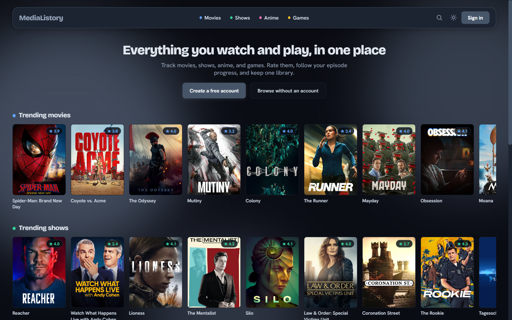
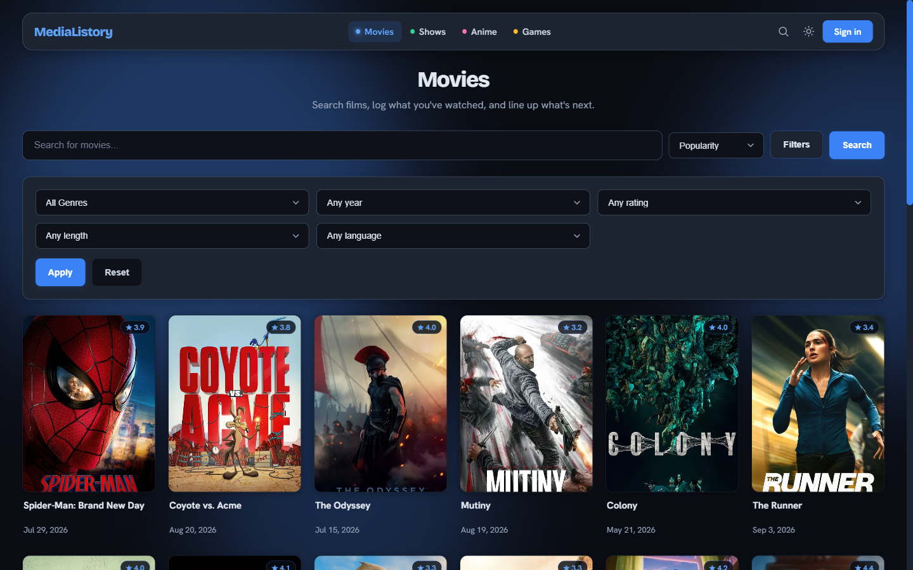
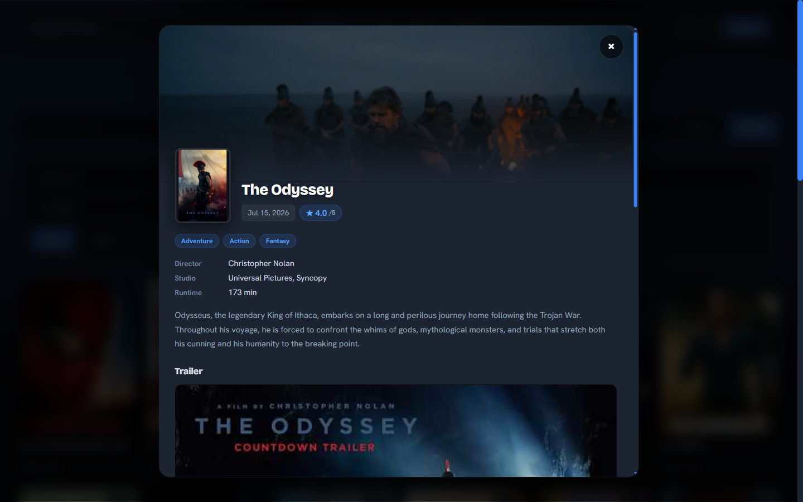
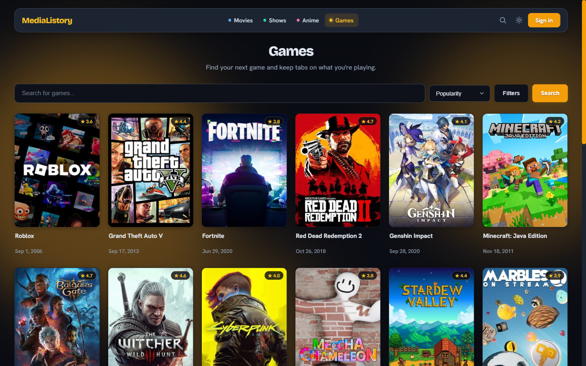

<p align="center">
  
</p>

<h1 align="center">MediaListory</h1>

<p align="center">
  One library for the movies, shows, anime, and games you go through.<br>
  <a href="https://medialistory.vercel.app"><b>medialistory.vercel.app</b></a>
</p>

<p align="center">
  <a href="https://github.com/Gr33nOps/medialistory/actions/workflows/ci.yml"></a>
  <a href="package.json"></a>
  <a href="LICENSE"></a>
</p>

MediaListory started as a game tracker and grew into one place for everything I watch and play. Movies and shows, anime, and games all share the same library, ratings, reviews, lists, and profile, so there is no juggling four apps to remember what you finished.

You can browse the whole thing without an account. Sign in when you want to start saving.

This repository is the app itself, MIT licensed. The tour below is the short version; [Running it yourself](#running-it-yourself) is the long one.

## A look around

You land on trending, not on an empty search box. Each category gets its own row, and nothing here is gated: browsing, searching, and opening a title all work signed out.



Every category browses on its own terms, because every provider does. Movies and shows come from TMDB, anime from Kitsu, games from IGDB, and each page only offers the filters its provider genuinely supports. Nothing is filtered client side after the fact, so an exact title match comes back first instead of whatever happened to be on the page you were already looking at.



Open a title and you get the whole record without leaving the grid: genres, director and studio, runtime, the synopsis, a trailer, where to watch it, and a few things to go to next. Saving it takes a status, a score out of ten, and a review if you feel like writing one.



The four categories are not skins over one page. Each carries its own accent color throughout, so you always know where you are: blue for movies, green for shows, pink for anime, amber for games.



## What you can do

Track movies, shows, anime, and games in one library, with a status, a score out of ten, and an optional review on anything. Shows and anime keep episode progress, with a one tap "+1" on whatever you are partway through. Custom lists can mix all four.

Beyond that:

- Search every category at once from the nav, with `/` or `Ctrl-K` to jump into it
- Filter and sort on what each provider actually exposes: genre, year, rating, language, and runtime for movies and shows; season, format, and age rating for anime; platform and game mode for games
- See a release calendar of what is coming next, merged across categories and grouped by month
- Look back on a year: hours, top genres, score distribution, and where the time went by category
- Import from a Letterboxd, MAL, or Trakt CSV, or a MediaListory JSON export, with a per row match preview before anything is written
- Follow people, keep your profile public or private, and see what they finished or rated
- Sign in with email and password, or with Google or GitHub
- Switch between light and dark, on desktop or phone

Admin and moderator dashboards ship with it for handling reports and bans.

## Credits

Movie and TV data from [TMDB](https://www.themoviedb.org/), anime from [Kitsu](https://kitsu.io/), and games from [IGDB](https://www.igdb.com/), a Twitch service. MediaListory uses these APIs but is not endorsed or certified by any of them. Every poster, title, and detail belongs to its owner.

---

# Running it yourself

## Stack

A plain HTML, CSS, and JavaScript frontend on a Node and Express API, with **Neon Postgres** behind it. No build step and no frontend framework. Email and password identity comes from Neon Auth; Google and GitHub sign-in runs as a direct OAuth2 code exchange on the API.

The deploy is split. The static frontend runs on **Vercel** and calls the API on **Render** cross origin, and Render can also serve the frontend itself as a same origin fallback. The app mints its own session JWT in an httpOnly cookie, and because the API performs the OAuth2 exchange itself, sessions survive that split.

### Media model

All media lives in one `games` catalog table, discriminated by `media_type` (`movie` | `series` | `anime` | `game`). Every row records its `provider` (`tmdb` | `kitsu` | `igdb`) and `provider_id`, and `game_id` is the universal external ref (`tmdb_movie_<id>`, `tmdb_series_<id>`, `kitsu_<id>`, `igdb_<id>`). A unique index on `(provider, media_type, provider_id)` guarantees IDs from different providers can never collide.

Tracking (`user_game_lists`, including `progress` for episodes watched) and custom lists (`custom_list_games`) reference that catalog, so they work for every media type unchanged. A new category such as books or music slots in as another `media_type` without schema churn.

## Quick start

Node.js 18 or newer, 20 LTS recommended.

```bash
git clone https://github.com/Gr33nOps/medialistory.git
cd medialistory
cp .env.example .env
npm install
```

1. Fill `.env` from [`.env.example`](.env.example): Neon `DATABASE_URL`, Neon Auth, JWT, Twitch/IGDB, and TMDB. Kitsu needs no key, and Google/GitHub OAuth is optional. The database string comes from the Neon Console under Connect, and the auth values from `neon neon-auth status --project-id <id> --branch production`.
2. Apply the schema to Neon: [`DB/schema.postgres.sql`](DB/schema.postgres.sql), then the migrations in [`DB/migrations/`](DB/migrations/) in order, through `neon psql` or the Neon SQL editor. See [`DB/README.md`](DB/README.md).
3. Start it:

```bash
npm start
```

Then open [localhost:3000](http://localhost:3000).

| Command | What it does |
|---------|--------------|
| `npm start` | Run the server |
| `npm run dev` | Run with nodemon reload |
| `npm test` | Unit and smoke tests |
| `npm run test:e2e` | Playwright end to end suite |

Do not set `ALLOW_DEGRADED=1` in production. It lets the server boot with a broken dependency.

## Deploy

**Render (API).** A web service running `npm start`, with the environment from `.env.example`. Use the Neon **pooled** `DATABASE_URL` (`...-pooler...neon.tech/neondb?sslmode=require&channel_binding=require`), plus `NEON_AUTH_BASE_URL`, `NEON_AUTH_JWKS_URL`, `JWT_SECRET`, IGDB, and TMDB. For social sign-in add `GOOGLE_CLIENT_ID`/`GOOGLE_CLIENT_SECRET` and `GITHUB_CLIENT_ID`/`GITHUB_CLIENT_SECRET`. Set `FRONTEND_URL=https://medialistory.vercel.app`, scheme included, so CORS and OAuth redirects point at the frontend.

**Vercel (frontend).** A static deploy of `Frontend/` per [`vercel.json`](vercel.json), no build step. The API origin is set in [`Frontend/common.js`](Frontend/common.js) and allowed in the Vercel CSP `connect-src`.

**OAuth apps.** Register the redirect URIs against the **API origin**, not the frontend: `https://medialistory.onrender.com/api/auth/oauth/google/callback` and the matching `/github/callback`. The API runs the exchange and redirects back to `FRONTEND_URL`.

Health probes are `/health` for liveness and `/ready` for database and IGDB reachability. Full procedures live in [`docs/runbook.md`](docs/runbook.md).

## Maintenance

**Keep-alive.** Neon auto suspends an idle project and auto resumes on the next connection, so nothing needs unpausing by hand. [`.github/workflows/keepalive.yml`](.github/workflows/keepalive.yml) runs Monday, Wednesday, and Friday at 12:00 UTC, plus on demand, and pings `/ready` to keep the deployed service warm and surface outages early. Point it elsewhere with a `READY_URL` repo variable.

**Security scanning.** CI runs a Semgrep SAST job over `Backend/` and `Frontend/` that fails the build on any `WARNING` or `ERROR` finding. Verified false positives are suppressed inline with justified `nosemgrep` comments. Locally:

```bash
semgrep scan --config p/security-audit --config p/secrets --config p/javascript --config p/nodejs --config p/expressjs --config p/owasp-top-ten --severity WARNING --severity ERROR --error Backend Frontend
```

## Layout

```text
MediaListory/
├── Backend/          Express API, plus the TMDB, Kitsu, and IGDB proxies
├── Frontend/         Static pages, CSS, JS
├── DB/
│   ├── schema.postgres.sql
│   ├── migrations/   Incremental SQL
│   └── legacy/       Archive and a one-time migrator
├── docs/             API notes, OpenAPI, runbook
├── test/             unit, smoke, e2e
└── .github/          CI and issue templates
```

Reference: [API contracts](docs/API.md) · [OpenAPI spec](docs/openapi.yaml) · [Runbook](docs/runbook.md)

## Contributing

Issues and pull requests are welcome. [CONTRIBUTING.md](CONTRIBUTING.md) covers the setup, what CI will check, and how the code is laid out. Security issues go through [SECURITY.md](SECURITY.md) rather than the public tracker.

## License

[MIT](LICENSE) © Gr33nOps
