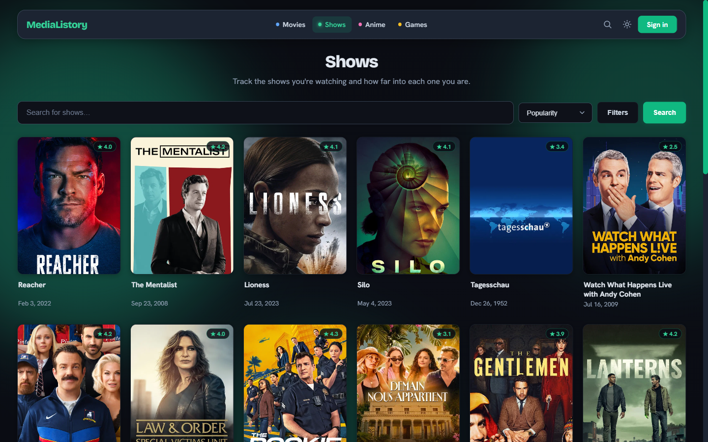
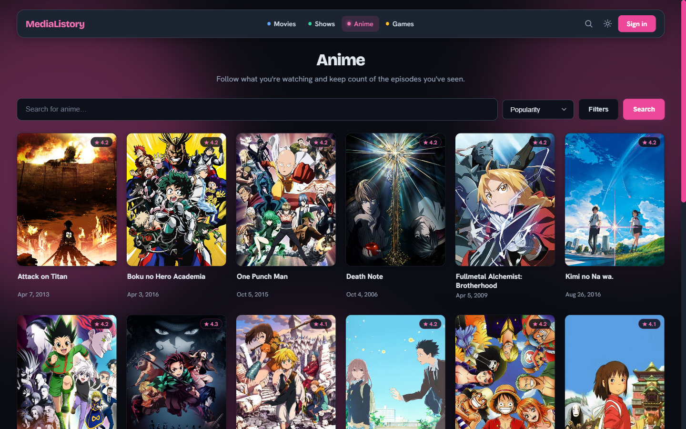

<p align="center">
  
</p>

<h1 align="center">MediaListory</h1>

<p align="center">
  One library for the movies, shows, anime, and games you go through.<br>
  <a href="https://medialistory.vercel.app"><b>medialistory.vercel.app</b></a>
</p>

<p align="center">
  <a href="https://github.com/Gr33nOps/medialistory/actions/workflows/ci.yml"></a>
  <a href="LICENSE"></a>
  <a href="package.json"></a>
  <a href="package.json"></a>
  <a href="CONTRIBUTING.md"></a>
  <a href="CODE_OF_CONDUCT.md"></a>
</p>

MediaListory started as a game tracker and grew into one place for everything I watch and play. Movies and shows, anime, and games all share the same library, ratings, reviews, lists, and profile, so there is no juggling four apps to remember what you finished.

You can browse the whole thing without an account. Sign in when you want to start saving.

This repository is the app itself, MIT licensed. The tour below is the short version; [Running it yourself](#running-it-yourself) is the long one.

## A look around

Everything here works signed out. Browsing, searching, filtering, and opening any title all work without an account; signing in is only for saving to your library, rating, and following people. Every category opens on popular titles rather than an empty box.

Each browses on its own terms, because every provider does. Movies and shows come from TMDB, anime from Kitsu, games from IGDB, and each page offers only the filters its provider genuinely supports. Nothing is filtered client side after the fact, so an exact title match comes back first instead of whatever was already on the page.

The four categories are not skins over one page. They share one layout, library, and rating system, but each carries its own accent color throughout, so you always know where you are.

|  |  |
|:--:|:--:|
| **Movies** — TMDB · blue | **Shows** — TMDB · green |
|  |  |
| **Anime** — Kitsu · pink | **Games** — IGDB · amber |

Open a title and the poster anchors the page. Beside it sit the genres, credits, runtime, and synopsis; below it the trailer, where to watch, and a few things to go to next. Depending on what it is, a title also picks up the best price today, its opening and ending themes, or the run it belongs to. Saving takes a status, a score out of ten, and a review if you feel like writing one.


## What you can do

Track movies, shows, anime, and games in one library, with a status, a score out of ten, and an optional review on anything. Shows and anime keep episode progress, with a one tap "+1" on whatever you are partway through. Custom lists can mix all four.

Beyond that:

- Search every category at once from the nav, with `/` or `Ctrl-K` to jump into it
- Filter and sort on what each provider actually exposes: genre, year, rating, language, and runtime for movies and shows; season, format, and age rating for anime; platform and game mode for games
- See a release calendar of what is coming next, merged across categories and grouped by month
- Look back on a year: hours, top genres, score distribution, and where the time went by category
- Import from a Letterboxd, MAL, or Trakt CSV, or a MediaListory JSON export, with a per row match preview before anything is written
- Rank a Top 10 of all time in each category, and show what you are part way through on your profile
- See how close someone else's taste is to yours as a percentage, worked out from shared titles, how you both scored them, your Top 10s, and the genres you gravitate to, and find people that way
- Follow people and get a feed of what they finished, started, or rated
- Compare libraries with someone side by side: what you both rank, what you both rate highly, what you disagree most about, and the same score broken down per category
- Keep your profile public or private
- Sign in with email and password, or with Google or GitHub
- Switch between light and dark, on desktop or phone

Admin and moderator dashboards ship with it for handling reports and bans.

## Open source

MediaListory is MIT licensed, has no build step, and needs no paid services beyond the data providers, so you can clone it and run your own copy. [Running it yourself](#running-it-yourself) is the full guide.

- **[MIT License](LICENSE)** — use it, fork it, ship it.
- **[Contributing guide](CONTRIBUTING.md)** — setup, what CI checks, and how the code is laid out. Issues and pull requests are welcome.
- **[Code of Conduct](CODE_OF_CONDUCT.md)** — short, and it comes down to criticise the work, not the person.
- **[Security policy](SECURITY.md)** — report a vulnerability privately instead of in the public tracker.
- **Issue templates** for [bug reports](.github/ISSUE_TEMPLATE/bug_report.md) and [feature requests](.github/ISSUE_TEMPLATE/feature_request.md), so a report carries what's needed to act on it.
- **Kept honest in CI** — every push runs the unit, smoke, and Playwright suites plus a Semgrep security scan that fails on any finding, and Dependabot watches dependencies.

The app is free and stays that way. If it's useful to you and you feel like it, there's a [Ko-fi](https://ko-fi.com/zain021xd) and [GitHub Sponsors](https://github.com/sponsors/Gr33nOps) — entirely optional.

## Credits

Movie and TV data from [TMDB](https://www.themoviedb.org/), anime from [Kitsu](https://kitsu.io/), and games from [IGDB](https://www.igdb.com/), a Twitch service.

Detail pages add a little on top of that catalogue, from sources that need no key: game prices from [CheapShark](https://www.cheapshark.com/), anime scores and studios from [MyAnimeList](https://myanimelist.net/) via [Jikan](https://jikan.moe/), opening and ending themes from [AnimeThemes](https://animethemes.moe/), and episode dates from [TVmaze](https://www.tvmaze.com/), whose data is used under [CC BY-SA](https://creativecommons.org/licenses/by-sa/4.0/).

MediaListory uses these APIs but is not endorsed or certified by any of them. Every poster, title, and detail belongs to its owner.

---

# Running it yourself

## Stack

A plain HTML, CSS, and JavaScript frontend on a Node and Express API, with **Neon Postgres** behind it. No build step and no frontend framework. Email and password identity comes from Neon Auth; Google and GitHub sign-in runs as a direct OAuth2 code exchange on the API.

The deploy is split. The static frontend runs on **Vercel** and calls the API on **Render** cross origin, and Render can also serve the frontend itself as a same origin fallback. The app mints its own session JWT in an httpOnly cookie, and because the API performs the OAuth2 exchange itself, sessions survive that split.

### Media model

All media lives in one `games` catalog table, discriminated by `media_type` (`movie` | `series` | `anime` | `game`). Every row records its `provider` (`tmdb` | `kitsu` | `igdb`) and `provider_id`, and `game_id` is the universal external ref (`tmdb_movie_<id>`, `tmdb_series_<id>`, `kitsu_<id>`, `igdb_<id>`). A unique index on `(provider, media_type, provider_id)` guarantees IDs from different providers can never collide.

Tracking (`user_game_lists`, including `progress` for episodes watched) and custom lists (`custom_list_games`) reference that catalog, so they work for every media type unchanged. A new category such as books or music slots in as another `media_type` without schema churn.

## Quick start

Node.js 18 or newer, 20 LTS recommended.

```bash
git clone https://github.com/Gr33nOps/medialistory.git
cd medialistory
cp .env.example .env
npm install
```

1. Fill `.env` from [`.env.example`](.env.example): Neon `DATABASE_URL`, Neon Auth, JWT, Twitch/IGDB, and TMDB. Kitsu needs no key, and Google/GitHub OAuth is optional. The database string comes from the Neon Console under Connect, and the auth values from `neon neon-auth status --project-id <id> --branch production`.
2. Apply the schema to Neon: [`DB/schema.postgres.sql`](DB/schema.postgres.sql), then the migrations in [`DB/migrations/`](DB/migrations/) in order, through `neon psql` or the Neon SQL editor. See [`DB/README.md`](DB/README.md). `add-external-id-map.sql` is worth applying even though nothing breaks without it: the detail-page extras fall back to resolving their ids live on every view, which is slower and spends more of the upstream budget.
3. Start it:

```bash
npm start
```

Then open [localhost:3000](http://localhost:3000).

| Command | What it does |
|---------|--------------|
| `npm start` | Run the server |
| `npm run dev` | Run with nodemon reload |
| `npm test` | Unit and smoke tests |
| `npm run test:e2e` | Playwright end to end suite |

Do not set `ALLOW_DEGRADED=1` in production. It lets the server boot with a broken dependency.

## Deploy

**Render (API).** A web service running `npm start`, with the environment from `.env.example`. Use the Neon **pooled** `DATABASE_URL` (`...-pooler...neon.tech/neondb?sslmode=require&channel_binding=require`), plus `NEON_AUTH_BASE_URL`, `NEON_AUTH_JWKS_URL`, `JWT_SECRET`, IGDB, and TMDB. For social sign-in add `GOOGLE_CLIENT_ID`/`GOOGLE_CLIENT_SECRET` and `GITHUB_CLIENT_ID`/`GITHUB_CLIENT_SECRET`. Set `FRONTEND_URL=https://medialistory.vercel.app`, scheme included, so CORS and OAuth redirects point at the frontend.

**Vercel (frontend).** A static deploy of `Frontend/` per [`vercel.json`](vercel.json), no build step. The API origin is set in [`Frontend/common.js`](Frontend/common.js) and allowed in the Vercel CSP `connect-src`.

**OAuth apps.** Register the redirect URIs against the **API origin**, not the frontend: `https://medialistory.onrender.com/api/auth/oauth/google/callback` and the matching `/github/callback`. The API runs the exchange and redirects back to `FRONTEND_URL`.

Health probes are `/health` for liveness and `/ready` for database and IGDB reachability. Full procedures live in [`docs/runbook.md`](docs/runbook.md).

## Maintenance

**Keep-alive.** Neon auto suspends an idle project and auto resumes on the next connection, so nothing needs unpausing by hand. [`.github/workflows/keepalive.yml`](.github/workflows/keepalive.yml) runs Monday, Wednesday, and Friday at 12:00 UTC, plus on demand, and pings `/ready` to keep the deployed service warm and surface outages early. Point it elsewhere with a `READY_URL` repo variable.

**Security scanning.** CI runs a Semgrep SAST job over `Backend/` and `Frontend/` that fails the build on any `WARNING` or `ERROR` finding. Verified false positives are suppressed inline with justified `nosemgrep` comments. Locally:

```bash
semgrep scan --config p/security-audit --config p/secrets --config p/javascript --config p/nodejs --config p/expressjs --config p/owasp-top-ten --severity WARNING --severity ERROR --error Backend Frontend
```

## Layout

```text
MediaListory/
├── Backend/          Express API, plus the TMDB, Kitsu, and IGDB proxies
│                     and enrich.js for the keyless secondary sources
├── Frontend/         Static pages, CSS, JS
├── DB/
│   ├── schema.postgres.sql
│   ├── migrations/   Incremental SQL
│   └── legacy/       Archive and a one-time migrator
├── docs/             API notes, OpenAPI, runbook
├── test/             unit, smoke, e2e
└── .github/          CI and issue templates
```

Reference: [API contracts](docs/API.md) · [OpenAPI spec](docs/openapi.yaml) · [Runbook](docs/runbook.md)

## Contributing

Issues and pull requests are welcome. [CONTRIBUTING.md](CONTRIBUTING.md) covers the setup, what CI will check, and how the code is laid out. Security issues go through [SECURITY.md](SECURITY.md) rather than the public tracker.

## License

[MIT](LICENSE) © Gr33nOps
